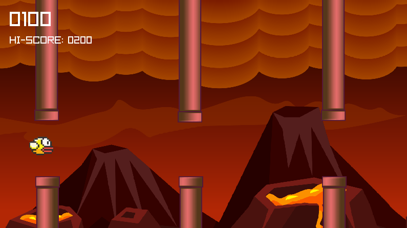

### Ian's Raylib Practices (C++)

This repo contains some personal practices with raylib, a simple and
easy-to-use library to enjoy videogames programming. I am using
raylib-cpp as an OOP wrapper around the original raylib v3.0.0, to
practice programming and working with basic graphics in C++.

### Screenshots

#### Flappy Bird Clone


<br/>



#### Classic Arkanoid Remake


### How to Install & Run?

This project relies on the installation of the
[raylib](https://www.raylib.com/) library. Installation instructions
of raylib can be found
[here](https://github.com/raysan5/raylib#build-and-installation).

I'm also using [raylib-cpp](https://github.com/RobLoach/raylib-cpp) as
an OOP wrapper around raylib, mainly to keep my code cleaner and
closer to the modern C++ syntax I'm used to. You can see the
differences between raylib syntax and raylib-cpp syntax
[here](https://github.com/RobLoach/raylib-cpp#features). Raylib-cpp is
a header-only library, and is already locally included in my repo
under the `include/` folder.

To compile and run a file under `src/`, you'll need several additional
flags. For example, suppose you want to play the Flappy Bird Clone
game:

```text
$ cd src/
$ g++ flappy_bird.cpp -lraylib -lGL -lm -lpthread -ldl -lrt -lX11 -std=c++17
$ ./a.out
```

### Credits

Many files are built upon examples provided by [raylib sample
games](https://www.raylib.com/games.html), with personal modification
and enhancement.
